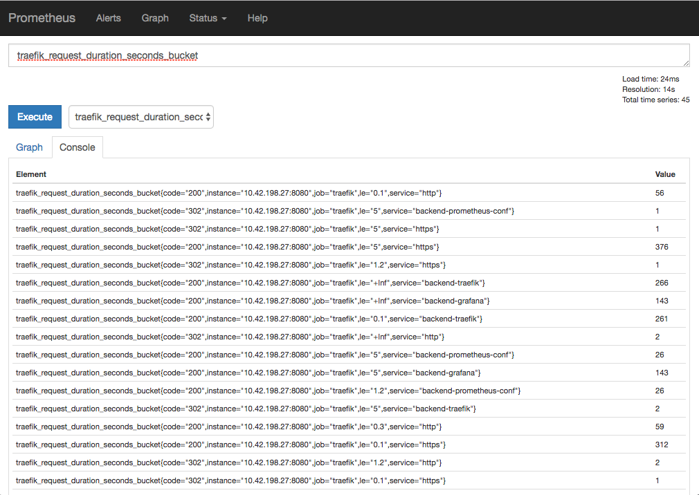
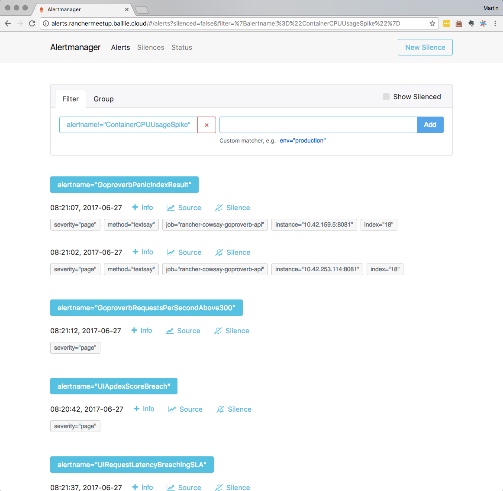

<!-- $theme: gaia -->

_Inclusive Monitoring with Rancher and Prometheus_
===

# 

##### Sydney Rancher Meetup June 2017
###### Martin Baillie (@martinbaillie / IAG)

---
<!-- *template: invert -->
# But first...

---
## Tonight's Demo Environment:
* **RancherOS**: Fast, ultra-lightweight container OS
* **GCP**: 3 Sydney zones as of last week.. $400 credit!
* **try.rancher.com**: Join hosts to your own free Rancher sandbox

 

---
# _"Inclusive Monitoring"?_

---
<!-- *template: invert -->
# Monitoring ALL the things


---
# Inclusive Monitoring
###### _(I've seen this also called "whitebox monitoring")_
Is about not just monitoring at the edge:
	- CPU, Memory, Threads, Swap, Net, `containerd`

But also instrumenting the code **within**.

Both technology metrics :sunglasses:
	- success rate, latency, saturation, pool size, db calls

And equally important... **business** metrics! :scream:
	- _e.g. insurance context:_ self-service logins, policies bought, quotes made, claims lodged, refunds given

---
<!-- *template: invert -->

# Meaning...

### Metric instrumentation needs to become a ==core== part of your engineering culture 

---
# Rancher and the Prometheus ecosystem can help with that
The demo will show these tools:
- Allowing developers to ship metrics, alerts, and dashboards alongside their code artefacts
- Having them auto-discovered (zero conf!)  
- Achieving automatic monitoring of infrastructure, UIs and a microservice architecture as it changes
- Stored as code, shippable to multiple environments immutably

---
# Prometheus


---
# Prometheus
Is a monitoring [eco]system and time-series database
- Originally written by ex-Googlers @ Soundcloud
- Inspired by Google's Borgmon monitoring system 
>_Even though Borgmon remains internal to Google, the idea of treating time-series data as a data source for generating alerts is now accessible to everyone_[SRE book on Prometheus]
- Prometheus is to Borgmon what Kubernetes is to Borg..._I guess_

---
# Prometheus
- A community OSS project (no single company)
	- With clear goals
	- Measured acceptance of PRs 
	- And a careful eye on potential scope creep
- Second accepted project to the CNCF (after K8s)
- Enterprise support by RobustPerception.io
- Written (mostly) in Golang
	- One of the most well-architected Go codebases I've studied \</opinion> 

---
# Key Features
- A powerful query language (Turing complete! :scream:)
- Efficient storage and dimensional data model
- Scalable telemetry (==pull-based==) monitoring
- Metric instrumenting libraries in many languages
- Tons of pre-canned exporters for existing systems
- Industry-leading visualisation by way of Grafana
- Alerting with many integrations via Alertmanager
- Simple APIs, easy deployment (static Golang binaries, Docker) and all configuration as code

---
# Pull-based Architecture


---
## 4 Simple, Expressive Metric Types
#### Counter, Gauge, Histogram, Summary


---
# As an aside: Metric != Log
Metrics are not a panacea. You will need multiple **complementary** tools for successful debugging.

||||
|:-:|:-:|:-:|
|**Metrics**|cheap, low cardinality | store lots|
|**Logs**|expensive, high cardinality | store few |


Metrics for _which service_ in a distributed system issue is. Log for digging deeper e.g. _which request_.


Also, **Metric != Trace**
You will still likely need distributed tracing in your microservice architecture (see OpenTracing, Zipkin)

---
# Metric Exporters and Client Libraries _(not exhaustive)_
- ==Server==, SNMP, Dovecot, Kubernetes, ==Rancher==, Mesos, Graphite, StatsD, Collectd, ==Expvar==, JMX, Spring, uWSGI, Cloudflare, AWS, VMWare, Solr, Apache, ==Traefik== HAProxy, Nginx, CouchDB, ElasticSearch, MongoDB, MySQL, Oracle, Redis, Memcached, OpenTSDB, RabbitMQ, IBM MQ, Kafka, Ceph, GlusterFS, ==Docker==, Jenkins...

- ==Go==, Java, Scala, Python, Ruby, Bash, C++, Common Lisp, Elixir, Erlang, Lua, .NET, ==Node.js==, PHP, Rust...

---
# Metric Instrumentation
Example: time taken to service a HTTP request?
##### Golang 

```go
var requestDuration = prometheus.NewSummaryVec(
prometheus.SummaryOpts{
	Name: "request_duration_seconds",
	Help: "Request duration in seconds",
}, []string{})

func my_handler(w http.ResponseWriter, r *http.Request) {
	defer func(begin time.Time) {
		requestDuration.With(nil).Observe(
    		time.Since(begin).Seconds())
	}(time.Now())
	// Your code here
```

---
# Even less LOC in other langs
##### Python Decorators
```python
REQUEST_DURATION = Summary('request_duration_seconds', 
'Request duration in seconds')

@REQUEST_DURATION.time()
def my_handler(request):
    pass # Your code here
```

##### Java Annotations
```
@RequestMapping
@PrometheusTimeMethod(name = "request_duration_seconds",
help="Request duration in seconds")
public myHandler() { // Your code here
```
---
# Eggs In One Basket
###### Or: _How I don't like hedging my bets in this industry_
1. Just like how using ==Rancher== as my container management does not preclude me from using:
	- Kubernetes, Mesos, Swarm as my orchestrator
2. Or how annotating my microservice code with ==OpenTracing== does not preclude me from using:
	- Zipkin, AppDash, Jaegar as my tracer

==Prometheus== libraries are open too! Instrument code using them; export  to Graphite, Collectd, Nagios etc.

---
# Alert On What Matters
```
ALERT HostDiskWillFillIn2Hours
  IF sum(predict_linear(node_filesystem_free[30m], 2*3600)) < 0
  LABELS { severity = "page" }
  ANNOTATIONS {
    summary="{{$labels.instance}} disk will fill in 2 hrs"
    
ALERT RancherContainerInstanceUnhealthy
  IF rancher_service_health_status{health_state != 
  	"healthy"} == 1
  FOR 5m
  LABELS { severity="notify", method="slack" }
  
ALERT AbnormalSelfServicePortalLoginRate
# Outside its Holt-Winters exponentially smoothed forecast 
  IF abs(job:portal_logins:rate1m - 
    job:portal_logins:holt_winters_rate5m)
    > abs(0.6 * job:portal_logins:holt_winters_rate5m)
```
---
# Alertmanager
<!-- *template: invert -->


---
# Alertmanager
Handles alerts sent by Prometheus (or other clients)

Takes care of:
- Grouping alerts of similar nature by category
- De-duplication of the same alerts
- Silencing alerts. Keep signal to noise ratio low!
- Routing alerts to receivers
	- Email, SMS, Slack, HipChat, PagerDuty, OpsGenie, VictorOps, ==Webhooks==

---
# Grafana
<!-- *template: invert -->


---
# Grafana
Leading open-source platform for beautifully visualising time-series analytics and monitoring

Takes care of:
- Querying Prometheus as a datasource
- Building dashboards on the exact queries you're using in Prometheus for alerts, reporting

Also has hundreds of pre-canned dashboards and other datasources e.g. Graphite, ElasticSearch, CloudWatch, InfluxDB, Splunk, DataDog, OpenTSDB

---
# Demo
<!-- *template: gaia -->
<!-- prerender: true -->

